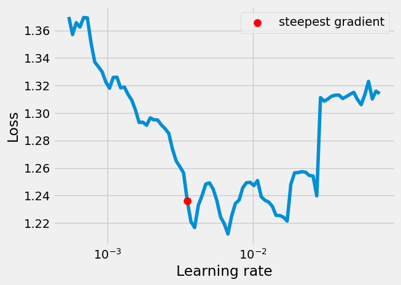
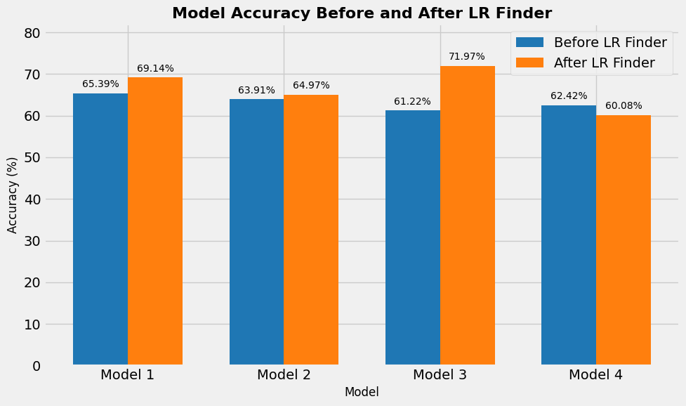
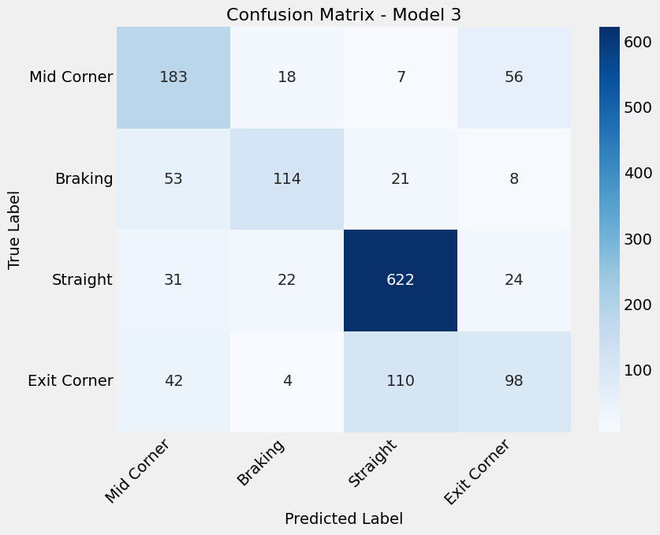

# UFRN-ML-2025-1-Iracing_Classification

#  🏎️🏎️🏎️ Introduction

This project focuses on predicting Simracing cornening phases using machine learning models. It includes data preparation, exploratory data analysis (EDA), model selection, parameter tuning.

---

# 🗂️ Table of Contents

1.  [📌 Project Overview](#-project-overview)
2.  [📁 Directory Structure](#-directory-structure)
3.  [❓ Problem Description](#-problem-description)
4.  [🚗 Dataset Generation](#-dataset-generation)
    * [Vehicles Used](#vehicles-used)
    * [Circuits Raced](#circuits-raced)
    * [Data Capture and Labeling Methodology](#data-capture-and-labeling-methodology)
5.  [📊 Exploratory Data Analysis (EDA)](#-exploratory-data-analysis-eda)
    * [Overall Class Distribution](#overall-class-distribution)
    * [Train vs. Validation Set Comparison](#train-vs-validation-set-comparison)
    * [Key Takeaways from EDA](#key-takeaways-from-eda)
6.  [⚙️ Data Pipeline](#-data-pipeline-from-raw-images-to-model-batches)
    * [Transformation and Standardization](#1-transformation-and-standardization)
    * [Data Loading and Batching](#2-data-loading-and-batching)
7.  [🧠 Model Configuration and Training](#-model-configuration-and-training)
    * [Experimental Models](#experimental-models)
    * [Learning Rate Selection](#learning-rate-selection)
    * [Training Process](#training-process)
8.  [📈 Results and Analysis](#-results-and-analysis)
    * [Initial Results (LR = 3e-4)](#-results-using-lr3e-4)
    * [Impact of Learning Rate Optimization (LR = 3.53e-3)](#-results-using-lr353e-3)
9.  [🏁 Conclusion](#-conclusion)


---

# 📌 Project Overview

Simracing is becoming even more popular nowadays. Even professionais drivers from Formula 1 uses this hardware in order to train before F1 sessions. This project uses deep learning techniques (Pytorch) to classify cornering phases in a virtual racing. 

Key features include:
- 🧹 Data preparation and cleaning.  
- 🔍 Exploratory Data Analysis (EDA).  
- 🧠 Model training, evaluation, and parameter optimization.  
- 🌐 Comparing models
- ☁️ Change hyper parameters

---

# 📁 Directory Structure

```plaintext
Heart-Disease-Classification/
│
├── data/                          	# Contains the dataset
├── data_preparation               	# Scripts for creating pytorch tensors
├── model_configuration            	# configure sequencial linear models
├── model_training                 	# script for train model    
├── images                         	# Contains images generates by model ouputs
├── EDA.ipynp                       # Jupyter notebook with Exploratory Data Analysis
├── Iracing_classification.ipynb  # Jupyter notebook using model 1 and 2 for classification
└── README.md                      	# Project description and instructions
```

---
# ❓ Problem Description

Driving analysis in simulators is crucial for performance improvement. This project was born from a passion for sim racing and aims to create an AI tool capable of automatically identifying which cornering phase a driver is in, based solely on the game's image.

The four classified phases are:

1.  **Braking:** The moment of approaching and decelerating before the corner.
2.  **Mid-corner:** The main cornering phase. This category combines the initial steering input (`Turn-in`) and passing the tightest point of the corner (`Apex`). The car is rotating and navigating the turn at its lowest speed.
3.  **Corner Exit:** The moment the driver unwinds the steering wheel and resumes acceleration towards the next straight.
4.  **Straight:** Driving on a straight section of the track, typically under full throttle with minimal steering input, connecting one corner to the next.

Below are image examples for each of the 4 classes used to train the model.

<p align="center">
  
  
  
    
</p>
<p align="center">
  <em>From left to right: Braking, Mid corner,Corner Exit and Straight.</em>
</p>

# 🚗 Dataset Generation

The foundation of this project is a custom dataset meticulously generated using the iRacing simulation software. The primary goal was to create a diverse and robust collection of images that captures a wide variety of driving scenarios. To achieve this, a carefully selected combination of vehicles and circuits was used, ensuring the model is exposed to different visual cues, cockpit layouts, lighting conditions, and track characteristics.

### Vehicles Used

Two cars with distinct physics and visual profiles were chosen to enhance the dataset's variety, providing the model with different reference points for the driver's field of view.

| <p align="center">Global Mazda MX-5 Cup</p> | <p align="center">Toyota GR86</p> |
| :---: | :---: |
| <br>  | <br>  |
| A momentum-based car known for its predictable handling, widely used in introductory racing series. | A modern sports car offering a different handling challenge and a more contemporary cockpit environment. |

### Circuits Raced

Data was collected on two internationally renowned circuits, each presenting unique corner types, elevation changes, and environmental textures.

| <p align="center">Oulton Park Circuit</p> | <p align="center">WeatherTech Raceway Laguna Seca</p> |
| :---: | :---: |
| <br>  |  |
| A narrow, undulating track in the UK, famous for its blind crests and technically demanding sections. | A classic American circuit in California, known for its iconic "Corkscrew" chicane and significant elevation changes. |

### Data Capture and Labeling Methodology

The dataset was built using a custom, two-step process to ensure both efficiency and accuracy.

1.  **Automated Image Capture**: A Python script, **`printscreen_generator.ipynb`**, was executed during gameplay on the circuits and with the cars mentioned above. This script was configured to automatically capture a high-resolution screenshot every one second, saving all raw images into a temporary folder named `print screen folder`.

2.  **Manual Classification Tool**: After the capture phase, a second Python script was used to facilitate a streamlined manual labeling process. This tool would open each image from the `print screen folder` individually, allowing for manual categorization. After an image was assigned to one of the four driving phases (Braking, Mid Corner , Corner Exit, or Straight), the script would automatically move the image file into its respective final directory within the dataset structure.

This two-step methodology allowed for the rapid collection of thousands of images, which were then carefully and accurately labeled by hand to create a high-quality dataset for training the model.

# 📊 Exploratory Data Analysis (EDA)
Before training the model, an Exploratory Data Analysis (EDA) was performed to understand the dataset's composition. This step is crucial for identifying characteristics like class imbalance, which can significantly influence model training and performance. The key findings are detailed below.

## Overall Class Distribution
First, we analyzed the total number of images for each of the four classes across the entire dataset. The distribution is clearly imbalanced.

As the graph shows, the Straight class is heavily over-represented compared to the others, containing more than double the images of the least-represented class, Braking. This imbalance is expected, as a car spends more time on straights than in specific braking zones, but it's a critical factor to consider. A model trained on this data might develop a bias towards predicting the majority class.


## Train vs. Validation Set Comparison
To ensure that our validation results are a reliable measure of performance, we verified that the class distribution is consistent between the training and validation sets.

The percentage distribution is remarkably similar across both sets. For example, the Braking class constitutes approximately 16% of the training set and 14% of the validation set, while the Straight class accounts for roughly 42% and 50%, respectively. This consistency is excellent, as it confirms that the validation set is a representative sample of the training data.


## Key Takeaways from EDA

**Imbalanced Dataset**: The dataset is significantly imbalanced, with a majority of images belonging to the Straight class.

**Representative Validation Set**: The proportional distribution of classes is consistent between the training and validation splits, ensuring that our evaluation metrics will be reliable.

**Modeling Strategy**: The class imbalance must be addressed during the modeling phase. Techniques such as using class weights in the loss function or applying data augmentation strategies like oversampling the minority classes should be considered to prevent model bias and improve performance on less-represented classes.

# ⚙️ Data Pipeline: From Raw Images to Model Batches

The journey from raw gameplay screenshots to model-ready data is handled by a comprehensive data pipeline built with PyTorch's `transforms`, `ImageFolder`, and `DataLoader` classes. This process is designed to standardize the images and efficiently feed them to the model.

Our Exploratory Data Analysis (EDA) revealed a significant class imbalance, which can be addressed with techniques like class weighting during training. The primary goal of this pipeline, however, is to first create a clean and consistent data format.

The pipeline consists of two main stages:

**1. Transformation and Standardization**

Every image is processed through a sequential transformation pipeline created with **`transforms.Compose`**. This ensures that every input to the model is uniform.

* **Resizing & Formatting:** Images are resized to a standard **128x128 pixels** using **`transforms.Resize()`** and converted to the **RGB** color space with a `ToImage()` transform.
* **Scaling & Standardization:** Pixel values are scaled to a `[0.0, 1.0]` range using **`ToDtype(torch.float32, scale=True)`**. Then, a more rigorous **standardization** is applied. This is achieved with a custom **`Architecture.make_normalizer()`** function that calculates the dataset's mean and standard deviation to create a final **`transforms.Normalize()`** instance.

**2. Data Loading and Batching**

After the transformation pipeline is defined, the **`ImageFolder`** and **`DataLoader`** classes manage the data flow:

* **`ImageFolder`** automatically discovers the classes from the folder names (`train_dataset_iracing` and `test_dataset_iracing`) and applies the `Compose` pipeline to each image.
* **`DataLoader`** then wraps the dataset to create **mini-batches of 16 images**. For the training set, the data is **shuffled** each epoch to improve model generalization, while the validation loader does not, ensuring consistent evaluation.

# 🧠 Model Configuration and Training

To identify the optimal architecture for this classification task, a systematic, experimental approach was taken. Three distinct model configurations were trained and evaluated, starting with a baseline model and then exploring variations in network width and depth.

## 1. Base Model Configuration

The initial model, which serves as our **base model**, is a custom convolutional neural network (CNN) defined as **`arch.cnn2`**. This architecture was configured with a specific number of feature maps in its convolutional layers.

* **Architecture:** `arch.cnn2`
* **Number of Features:** `num_features = 5`

This configuration provides a benchmark against which all other experiments are measured.

## 2. Experiment 1: Varying Network Width

To analyze the impact of the number of feature maps (network width), the base model was re-trained with two variations, altering only the `num_features` parameter:

* **Simpler Model:** `num_features = 3`
* **More Complex Model:** `num_features = 10`

This experiment helps determine if a wider (more features) or narrower (fewer features) network is better suited for this specific image dataset.

## 3. Experiment 2: Increasing Network Depth

To test the effect of a deeper architecture, a third model was created by modifying the base `arch.cnn2` architecture.

* **Modification:** An additional convolutional block was inserted into the network.

This experiment investigates whether a deeper model, with more layers, can learn more complex hierarchical features from the images and improve classification accuracy.

## Learning Rate Selection

All models were initially trained with a fixed learning rate of **3e-4** to establish a baseline performance. After observing the initial training losses from this process, the **`pytorch-lr-finder`** library was used as a verification step to determine if this learning rate was optimal.

The LR Finder works by running a short training session where the learning rate is gradually increased and the corresponding loss is recorded. This helps to systematically identify a range for the optimal learning rate, which is typically where the loss is decreasing most steeply.

The goal of this subsequent analysis was to compare our initial choice of **3e-4** against the rate suggested by the LR Finder (**`3.53e-3`**), providing a more robust validation of the chosen hyperparameters.



# Training Process

To ensure a fair comparison, all model configurations were trained using an identical setup, managed by a custom `Architecture` class that encapsulates the model, loss function, and optimizer.

The key components and hyperparameters of the training pipeline are:

* **Reproducibility:** A fixed random seed, **`torch.manual_seed(13)`**, was set to ensure that experiments are reproducible.
* **Loss Function:** The **`nn.CrossEntropyLoss`** was used as the criterion. This loss function is standard for multi-class classification tasks.
* **Optimizer:** The **`Adam`** optimizer was chosen to update the model's weights, with a base learning rate set to **`3e-4`**. and later on the models were trained with suggested lambda rate of **`3.53e-3`**
* **Regularization:** A dropout rate of **`p=0.3`** was applied within the `CNN4` model architecture to help prevent overfitting.
* **Epochs:** Each model was trained for a total of **8 epochs**.

After training was complete, the final state dictionary of the model was saved to a file (e.g., `base_model_cnn2.pth`) for evaluation and future use. The training and validation loss curves were also plotted to visually assess the model's learning progress.

# 📊 Results using LR=3e-4

This section presents the performance of the four trained model configurations. The goal is to compare their effectiveness and select the best-performing architecture for the final classification task. **Validation Accuracy** was used as the primary metric for comparison.

## Performance Metrics Comparison

The table below summarizes the final validation performance for each of the four experimental models after 8 epochs of training.

| Model Configuration | Validation Accuracy | Notes |
| :--- | :---: | :--- |
| **1. Base Model** (`n_feature=5`) | `65.4%` | The benchmark performance. |
| **2. Short Model** (`n_feature=3`) | `63.9%` | Performance of the model with fewer features. |
| **3. Wider Model** (`n_feature=10`) | `61.2%` | Performance of the model with more features. |
| **4. Deeper Model** (+1 Conv Block) | `62.4%` | Performance of the model with more layers. |


**Analysis:** The results indicate that the **Base Model** achieved the highest validation accuracy, while the `model 3` had the lowest. However, it has to bear in mind that base model has got 65% of accuracy, which is very low!

This suggests that for this task, no models had greate performance. Indicating that we need to evaluate a better CNN Architecture.

### Analysis of the Best Model

Based on the results, the **Base model** was selected as the final model. A confusion matrix was generated to provide a more detailed look at its performance across the four classes.


The confusion matrix for the Base Model provides a detailed look at its performance on a class-by-class basis.

**Key Insights:**

* **High Performance on `Straight`:** The model excels at identifying the **`Straight`** class, correctly classifying 604 instances. This is likely due to the distinct visual features of a straight line and this class having the most samples in the dataset.

* **Significant Confusion Between Adjacent Phases:** The model's primary weakness is confusing classes that are visually similar and sequential in a lap.
    * The most significant error is misclassifying **`Mid Corner`** as **`Exit Corner`** 134 times. This is logical, as the visual transition from being at the apex to beginning the exit is extremely subtle.
    * Similarly, it frequently confuses **`Exit Corner`** with **`Straight`** (95 times), which is expected as one phase flows directly into the next.

* **Moderate Performance on Cornering Classes:** The **`Braking`** and **`Exit Corner`** classes show moderate performance. While the model correctly identifies many instances, it often confuses them with the `Straight` class, highlighting the difficulty in capturing the exact start and end points of a corner.

Overall, the Base Model is effective at identifying the most distinct phase (`Straight`) but struggles with the nuanced transitions between cornering stages. This suggests that more complex models may be needed to better distinguish these subtle features.

# 📊 Results using LR=3.53e-3

After the initial training, all four models were re-trained using the higher learning rate of **$3.53 \times 10^{-3}$** suggested by the LR Finder. The goal was to validate if this new rate would improve performance. The results are compared below.



**Key Insights:**

* **Significant Improvement for Deeper Model:** **Model 3 (the Deeper Model)** saw the most dramatic performance increase, jumping from **61.22%** to **71.97%** accuracy. This strongly suggests that the initial, lower learning rate was preventing the deeper architecture from converging to its optimal solution. See confusion matrix below.

* **General Effectiveness:** The higher learning rate also improved the performance of **Model 1 (Base Model)** and **Model 2 (Short Model)**, confirming that the initial learning rate was too conservative for most of the tested architectures.

* **Negative Impact on Wider Model:** Interestingly, **Model 4 (the Wider Model)** performed *worse* with the higher learning rate, with its accuracy dropping from 62.42% to 60.08%. This indicates that different model architectures can have different optimal learning rates, and a wider network may be more sensitive to higher rates, potentially causing it to overshoot a good solution during training.



**Conclusion:** This experiment validates the use of the LR Finder as a crucial step for hyperparameter tuning. It not only improved performance across most models but also identified the **Deeper Model, when trained with the higher learning rate, as the clear best-performing architecture.**

# 🏁 Conclusion

This project successfully developed and evaluated a convolutional neural network capable of classifying distinct driving phases from iRacing gameplay footage. Through a systematic approach involving data generation, exploratory analysis, and experimental model training, we were able to build a functional proof-of-concept for real-time driving analysis.

The key finding of our experimental process was that model architecture and hyperparameter tuning are both critical for performance. The **Deeper Model**, which featured an additional convolutional block, ultimately provided the highest accuracy, but still low. Furthermore, the use of an **LR Finder** was instrumental; it identified a learning rate ten times higher than our initial choice, which unlocked significant performance gains and pushed the final model's accuracy to **over 71%**.

The primary challenge remains the model's difficulty in distinguishing between visually similar and chronologically adjacent phases, such as `Mid Corner` and `Exit Corner`. This highlights the inherent subtlety of the classification task. Future work should focus on addressing the dataset's class imbalance through techniques like class weighting and expanding the dataset with more cars and tracks.

Overall, the project demonstrates the viability of using computer vision to interpret complex driving behavior, laying the groundwork for potential applications in real-time driver coaching or post-race analysis tools.


   


